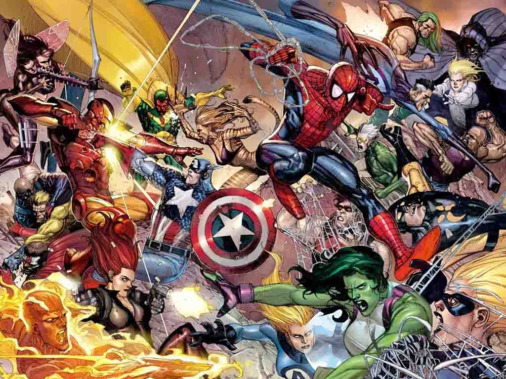

# Avengers Assemble

## Description
Ever wondered who the *strongest* Marvel character is? Or the *fastest*? 
Or perhaps you think you know everything there is to know about Marvel characters?
You can find the answers to these questions or prove your knowledge and more in **Avengers Assemble**!

## MVP 
The MVP will cover the following:

**Homepage**: The homepage will present the apps concept and features and provide links to the rest of the site.

**Characters**: A user will be able to input a value for different categories and find the Marvel character that is closest to those values.
They will also be able to play a game to test their knowledge on this subject.

**Signup**: A registration form for new users.

**Login**: A sign in form for existing users.

## Backlog    
*Countdown*: A simple countdown indicating the days, minutes... left for the next MCU movie. (done)

*Search the hero*: A short section in 'Home' where the user will be able to search for their favorite characters and find information. (done)

*Ranking*: Keeps track of the user's scores and let's them know when they've gotten a high score.

## Wireframes    
You can find the wireframe in the *wireframe.jpg*

## APIs
'https://superheroapi-m1.herokuapp.com/heroes'

## Links
[Avengers Assemble](https://ebm90.github.io/Avengers_Assemble/)

### Trello (list of tasks)
[Trello](https://trello.com/b/zhPxnUFt/proyecto-1)

### Github
URls for the project repo and deploy
[Repository](https://github.com/EBM90/Avengers_Assemble) 
[Deploy](https://ebm90.github.io/Avengers_Assemble/)
